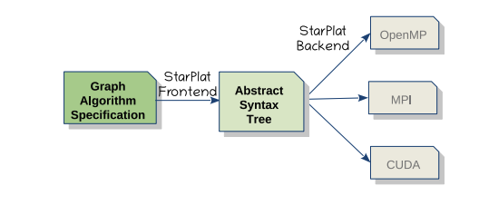

# StarPlat Documentation

# What is StarPlat?

StarPlat is designed to make parallel computing easier for users. It reduces the need for complex parallelization instructions while still delivering performance close to hand-optimized code. When choosing between simplicity and performance, StarPlat prioritizes simplicity because it is mainly for domain experts.

StarPlat provides key features and data types for static graph algorithms, including Graph, Node, Edge, and PropNode (for node properties). Users write in a procedural style and suggest parallelization opportunities using constructs like `forall`. The compiler then decides how to apply parallel execution, including nested `forall` loops. Many graph algorithms involve repeated execution until they reach a stopping condition, which StarPlat manages with the `fixedPoint`construct.

For handling updates efficiently, StarPlat includes batch processing constructs such as `Batch`, `OnDelete` (for removing edges), and `OnAdd` (for adding edges). The `Batch` construct defines preprocessing steps before executing these handlers. In incremental processing, only changes from added edges are handled, while decremental processing deals with edge deletions.



# How to write and run code?

To run a code in StarPlat, you have to follow the following flow,

***DSL → Code Generation → Code Compilation → Running code for different backends.***

Note: Try to [setup ssh in vscode](https://www.youtube.com/watch?v=rh1Ag41J6IA) instead of terminal it will save more time.

## DSL

To begin, you first need to write the DSL code. Keep the following points in mind:

- Do not include an extension in the DSL file name. For example, if you're writing a DSL file for `triangle_count`, name the file `triangle_count`, not `triangle_count.ext`.
- Store static graph codes in the [static graph directory](https://github.com/ashwinktpu/StarPlat/tree/WorkingBranch/graphcode/staticDSLCodes) and dynamic graph codes in the [dynamic graph directory](https://github.com/ashwinktpu/StarPlat/tree/WorkingBranch/graphcode/dynamicDSLCodes) for better organization.
- `Aqua` is recommended to run StarPlat. This documentation will follow the `Aqua` workflow.

Note: "Aqua" refers to IIT Madras' Aqua Cluster (High Performance Computing Environment). For more information, see [HPCE Guidelines](https://cc.iitm.ac.in/hpce/hpceguidelines.html), [Aqua Cluster](https://hpce.iitm.ac.in/content.php?navigate=aquacluster), and [Aqua Cluster | P.G. Senapathy Centre for Computing Resources](https://cc.iitm.ac.in/hpce/aqua.html).

*Note: you can find [DSL code walkthrough (by Nibedita) here](https://drive.google.com/file/d/16RR6COlILdd2UxSjo_aUbHtjnvCGsqaw/view).*

## Code Generation

Now the DSL code is ready to us. So to Compile we have to go [**StarPlat/src](https://github.com/ashwinktpu/StarPlat/tree/WorkingBranch/src).**

And Inside this directory you have to run the following commands,

```visual-basic
make clean
make
```

*Note: you have to run this commands on first time of using StarPlat or if you have done any changes to StarPlat not for everytime of writing DSL.*

Now, to generate code to a desired backend you have run the following command inside same directory,

```visual-basic
./StarPlat [-s|-d] -f <dsl.sp(DSL code file path)> -b [cuda|omp|mpi|acc|sycl]
```

Say we want to generate static code of triangle count for OpenMP backend. So we have to write,

```visual-basic
./StarPlat -s -f /lfs/usrhome/mtech/cs23m006/new_repo/starplat/graphcode/staticDSLCodes/triangle_counting_dsl -b omp
```

Note: Always try to use absolute path not relative path.

## Debugging (if you find any error)

If you face any segmentation fault or any error what you need to debug you may use gdb (this is while code generation). It is better to run those three commands separately.

```bash
gdb ./Starplat
run -s -f <file_path> -b cuda|omp|mpi 
bt
```

## Code Compilation

To compile code you have to write a main function where you have to include the generated code file from the generated_$backend folder [here](https://github.com/ashwinktpu/StarPlat/tree/WorkingBranch/graphcode). 

### **OpenMP**

For OpenMP the following main.cpp is shown for triangle count. You can just change the header file name everytime when you compile.

```cpp
#include <iostream>
#include <fstream>
#include <sstream>
#include <vector>
#include <set>
#include <map>
#include <algorithm>
#include <cstring>
#include <climits>
#include "/lfs/usrhome/mtech/cs23m006/new_repo/starplat/graphcode/generated_omp/triangle_counting_dsl.cc"
int main(int argc, char*argv[]) {
    char* filePath;

    if (argc == 1) {
        std::string inputPath;
        std::cout << "Enter the path to the graph file: ";
        std::getline(std::cin, inputPath);

        filePath = new char[inputPath.length() + 1]; 
        std::strcpy(filePath, inputPath.c_str());
    } else if (argc == 2) {
        filePath = argv[1];
    } else {
        return 1;
    }

    graph g(filePath);

    g.parseGraph();
    std::cout << "Number of nodes: " << g.num_nodes() << std::endl;
    std::cout << "Number of edges: " << g.num_edges() << std::endl;
    double starttime = omp_get_wtime();
   long num_triangles = Compute_TC(g);
   double endtime = omp_get_wtime();
    std::cout << "Number of triangles in the graph: " << num_triangles << std::endl;
    std::cout<<"Time taken : "<<endtime-starttime<<std::endl;
    return 0;
    }
```

For OpenMP you can use both terminal and `qsub`  to execute the main.cpp file.

This is the command to compile the OpenMP code:

```visual-basic
g++ main.cpp -fopenmp -o main
```

### **MPI**

For MPI the following main.cpp is shown for triangle count. You can just change the header file name everytime when you compile.

```cpp
#include <iostream>
#include "/lfs/usrhome/oth/rnintern/cs23m006/starplat_new/starplat/graphcode/mpi_header/graph_mpi.h"
#include "/lfs/usrhome/oth/rnintern/cs23m006/starplat_new/starplat/graphcode/mpi_header/profileAndDebug/mpi_debug.c"
#include"/lfs/usrhome/oth/rnintern/cs23m006/starplat_new/starplat/graphcode/generated_mpi/triangle_counting_dsl.cc"

long Compute_TC(Graph&, boost::mpi::communicator);

int main(int argc, char *argv[]) {
    char* filePath;
		boost::mpi::environment env(argc, argv);
    boost::mpi::communicator world;
    if (argc == 1) {
        std::string inputPath;
        std::cout << "Enter the path to the graph file: ";
        std::getline(std::cin, inputPath);

        filePath = new char[inputPath.length() + 1];
        std::strcpy(filePath, inputPath.c_str());
    } else if (argc >=2 ) {
        filePath = argv[1];
    } else {
        return 1;
    }

   Graph graph(argv[1],world,1);

    double t1 = MPI_Wtime();
    auto ans=Compute_TC(graph,graph.num_nodes(),world);
    std::cout << "No of nodes  " << graph.num_nodes() << std::endl;
	double t2 = MPI_Wtime();
		print_mpi_statistics();
		if (world.rank() == 0)
    {
        std::cout << "Total Triangle: " << ans << std::endl;
        std::cout << "TIME:[" << (t2 - t1) << "]" << std::endl;
    }
    world.barrier();
    return 0;
    }
```

### **Cuda**

For Cuda the following main.cu is shown for triangle count. You can just change the header file name everytime when you compile.

Note: here main file name should be [main.cu](http://main.cu) not main.cpp.

This is for loading right cuda version.

```bash
#module unload $current_gcc (if other than gcc920)
module load gcc920
module unload cuda10.1
module load cuda11.4
```

This is [main.cu](http://main.cu) file sample snippet.

```cpp

#include <cuda_runtime.h>
#include <cuda.h>
#include <iostream>
#include "/lfs/usrhome/mtech/cs23m006/new_repo/starplat/graphcode/generated_cuda/APFB_Matching.cu"

int main(int argc, char* argv[]) {
    char* filePath;
    char* updateFile;
    if (argc == 2) {
        filePath = argv[1];
    } else if (argc==3){
        filePath = argv[1];
        updateFile=argv[2];

    }else{
        return 1;
    }
    graph g(filePath);
    g.parseGraph();
    std::cout << "Number of nodes: " << g.num_nodes() << std::endl;
    std::cout << "Number of edges: " << g.num_edges() << std::endl;

    cudaEvent_t start, stop;
    cudaEventCreate(&start);
    cudaEventCreate(&stop);

    cudaEventRecord(start, 0);
    long ans = Compute_TC(g, g.num_nodes());
    cudaEventRecord(stop, 0);
    cudaEventSynchronize(stop);

    float milliseconds = 0;
    cudaEventElapsedTime(&milliseconds, start, stop);
    std::cout << "Total Trinagles: " << ans << std::endl;
    std::cout << "\nGPU Time: " << milliseconds / 1000.0 << " seconds" << std::endl;
    cudaEventDestroy(start);
    cudaEventDestroy(stop);
    return 0;
}
```

## Running Code for Different backends

All the graphs are present here,

```visual-basic
/lfs1/usrscratch/phd/cs16d003/11suiteDSL/
```

### OpenMP

If you are using the terminal use the following command,

```visual-basic
export OMP_NUM_THREADS=16
main $input_file $update_path(if any) > $output_file_path
```

if you are using `qsub`  to submit jobs, then you following script for the OpenMP can be followed,

```visual-basic
#!/bin/bash
#PBS -o logfile.log
#PBS -e errorfile_slash.err
#PBS -l walltime=24:00:00
#PBS -l select=1:ncpus=32
tpdir=`echo $PBS_JOBID | cut -f 1 -d .`
tempdir=$HOME/scratch/job$tpdir
mkdir -p $tempdir
cd $tempdir
cp -R $PBS_O_WORKDIR/* .
export OMP_NUM_THREADS=16
/lfs/usrhome/mtech/cs23m006/new_repo/starplat/graphcode/main /lfs/usrhome/mtech/cs23m006/new_repo/starplat/graphcode/sample_graph_loaded/cleancom-orkutud.txt /lfs/usrhome/mtech/cs23m006/new_repo/starplat/graphcode/sample_graph_loaded/update_orkut.txt > apfb_dyn_orkut_16_0.04.txt
mv ../job$tpdir $PBS_O_WORKDIR/.
```

Note: 

1. Add this line `#PBS -q rupesh_gpuq` if you are have the permission to use the queue from Prof. Rupesh Nasre.
2. Don’t use `ncpus` value other than 32 as there is a high chance that the script will not work. Also we don’t need gpus for OpenMP so we are not using it.
3. `walltime` can be reduced.

### MPI

For MPI we are using `rnintern`  account (access should be given by Rupesh sir).

To compile static code we have to use the following command,

```visual-basic
mpicxx -I/lfs/usrhome/oth/rnintern/scratch/MPI_Comparison/boost/install_dir/include $(path to main.cpp) /lfs/usrhome/oth/rnintern/cs23m006/starplat_new/starplat/graphcode/mpi_header/graph_mpi.cc $(add all the headers are using) ../boost/install_dir/lib/libboost_mpi.a ../boost/install_dir/lib/libboost_serialization.a -o main
```

As the example of above code snippet I am giving an example of `APFB` matching. In `APFB` , I am using the following header `rma_datatype.cc`, edge_property.cc, `node_property.cc` . So the snippet will look like,

```visual-basic
mpicxx -I/lfs/usrhome/oth/rnintern/scratch/MPI_Comparison/boost/install_dir/include /lfs/usrhome/oth/rnintern/cs23m006/starplat_new/starplat/graphcode/main.cpp /lfs/usrhome/oth/rnintern/cs23m006/starplat_new/starplat/graphcode/mpi_header/graph_mpi.cc /lfs/usrhome/oth/rnintern/cs23m006/starplat_new/starplat/graphcode/mpi_header/rma_datatype/rma_datatype.cc /lfs/usrhome/oth/rnintern/cs23m006/starplat_new/starplat/graphcode/mpi_header/graph_properties/edge_property/edge_property.cc /lfs/usrhome/oth/rnintern/cs23m006/starplat_new/starplat/graphcode/mpi_header/graph_properties/node_property/node_property.cc ../boost/install_dir/lib/libboost_mpi.a ../boost/install_dir/lib/libboost_serialization.a -o main
```

*Note: You can use the same snippet for dynamic code by changing header only.*

Now to submit a job for MPI using `rnintern`  account you can use the following script.

```visual-basic
#!/bin/bash
#PBS -o logfile.log
#PBS -e errorfile_slash.err
#PBS -l walltime=01:00:00
#PBS -l select=1:ncpus=1:ngpus=1
#PBS -q rupesh_gpuq
module load openmpi316
module unload gcc920
module load gcc13.1.0

#tpdir=`echo $PBS_JOBID | cut -f 1 -d .`
#tempdir=$HOME/scratch/job$tpdir
#mkdir -p $tempdir
#cd $tempdir

#mpicxx -I/lfs/usrhome/oth/rnintern/scratch/MPI_Comparison/boost/install_dir/include /lfs/usrhome/oth/rnintern/cs23m006/starplat_new/starplat/graphcode/main.cpp ../boost/install_dir/lib/libboost_mpi.a ../boost/install_dir/lib/libboost_serialization.a -o $PBS_O_WORKDIR/main_exe

/lfs/sware/openmpi316/bin/mpirun -np 2 -hostfile $PBS_NODEFILE /lfs/usrhome/oth/rnintern/scratch/MPI_Comparison/boost/main /lfs1/usrscratch/phd/cs16d003/11suiteDSL/cleaned-graphs/cleancom-orkutud.txt /lfs/usrhome/oth/rnintern/cs23m006/update_sample.txt > $PBS_O_WORKDIR/output_.txt

#mv ../job$tpdir $PBS_O_WORKDIR/.
```

### Cuda

The script for aqua for `cuda` code is below.

```bash
#PBS -e errorfile.err
#PBS -o logfile.log
#PBS -l walltime=01:00:00
#PBS -l select=1:ncpus=1:ngpus=1
#PBS -q rupesh_gpuq
tpdir=`echo $PBS_JOBID | cut -f 1 -d .`
tempdir=$HOME/scratch/job$tpdir
mkdir -p $tempdir
cd $tempdir
cp -R $PBS_O_WORKDIR/* .
module load gcc920
module load cuda11.4
module load python385
./a.out < input.txt > output.txt
mv * $PBS_O_WORKDIR/.
rmdir $tempdir
```

# Additional Tips

1. To save time, you can use an alias and execute an initial command before proceeding with the rest. I have given an example of my my `.bsh.txt` file.

```visual-basic
alias output_dir="cd /lfs/usrhome/oth/rnintern/cs23m006"
alias boost_wd="cd /lfs/usrhome/oth/rnintern/scratch/MPI_Comparison/boost"
alias code_wd="cd /lfs/usrhome/oth/rnintern/cs23m006/starplat_new/starplat"
module load openmpi316
alias qs="qsub /lfs/usrhome/oth/rnintern/cs23m006/script.cmd"
alias qr="qstat rupesh_gpuq"
alias clr="clear"
alias mpimain="mpicxx -I/lfs/usrhome/oth/rnintern/scratch/MPI_Comparison/boost/install_dir/include /lfs/usrhome/oth/rnintern/cs23m006/starplat_new/starplat/graphcode/main.cpp /lfs/usrhome/oth/rnintern/cs23m006/starplat_new/starplat/graphcode/mpi_header/graph_mpi.cc /lfs/usrhome/oth/rnintern/cs23m006/starplat_new/starplat/graphcode/mpi_header/rma_datatype/rma_datatype.cc /lfs/usrhome/oth/rnintern/cs23m006/starplat_new/starplat/graphcode/mpi_header/graph_properties/edge_property/edge_property.cc /lfs/usrhome/oth/rnintern/cs23m006/starplat_new/starplat/graphcode/mpi_header/graph_properties/node_property/node_property.cc ../boost/install_dir/lib/libboost_mpi.a ../boost/install_dir/lib/libboost_serialization.a -o main"

alias mpimaindyn="mpicxx -I/lfs/usrhome/oth/rnintern/scratch/MPI_Comparison/boost/install_dir/include /lfs/usrhome/oth/rnintern/cs23m006/starplat_new/starplat/graphcode/mainDyn.cpp /lfs/usrhome/oth/rnintern/cs23m006/starplat_new/starplat/graphcode/mpi_header/graph_mpi.cc /lfs/usrhome/oth/rnintern/cs23m006/starplat_new/starplat/graphcode/mpi_header/updates.cc /lfs/usrhome/oth/rnintern/cs23m006/starplat_new/starplat/graphcode/mpi_header/rma_datatype/rma_datatype.cc /lfs/usrhome/oth/rnintern/cs23m006/starplat_new/starplat/graphcode/mpi_header/graph_properties/edge_property/edge_property.cc /lfs/usrhome/oth/rnintern/cs23m006/starplat_new/starplat/graphcode/mpi_header/graph_properties/node_property/node_property.cc ../boost/install_dir/lib/libboost_mpi.a ../boost/install_dir/lib/libboost_serialization.a -o main"

alias graph_dir="cd /lfs1/usrscratch/phd/cs16d003/11suiteDSL/"

alias code_mpi="cd /lfs/usrhome/oth/rnintern/cs23m006/starplat_new/starplat/graphcode/generated_mpi"
```

then just go the the directory of `bsh.txt` , and run `. bsh.txt` 

1. To know the available module in `Aqua` we can use the following command,
`module avail` . Then `module load $pkg_name` ,if we want to remove a module we can use `module unload $pkg_name` .

## Publication

[StarPlat: A versatile DSL for graph analytics](https://www.sciencedirect.com/science/article/pii/S074373152400131X); Nibedita Behera, Ashwina Kumar, Ebenezer Rajadurai T, Sai Nitish, Rajesh Pandian M, Rupesh Nasre; IJPP 2024

## Acknowledgments

```
This project is funded by India's National Supercomputing Mission, whose timely funding and regular reviews are greatly appreciated.
Part of the work is supported by Qualcomm Innovation Fellowship 2023. 
```

## Licensing

The StarPlat codebase is made available for academic and non-commercial use.
StarPlat is patented. Commercial use of the code needs licensing. The interested may contact rupesh@cse.iitm.ac.in.
