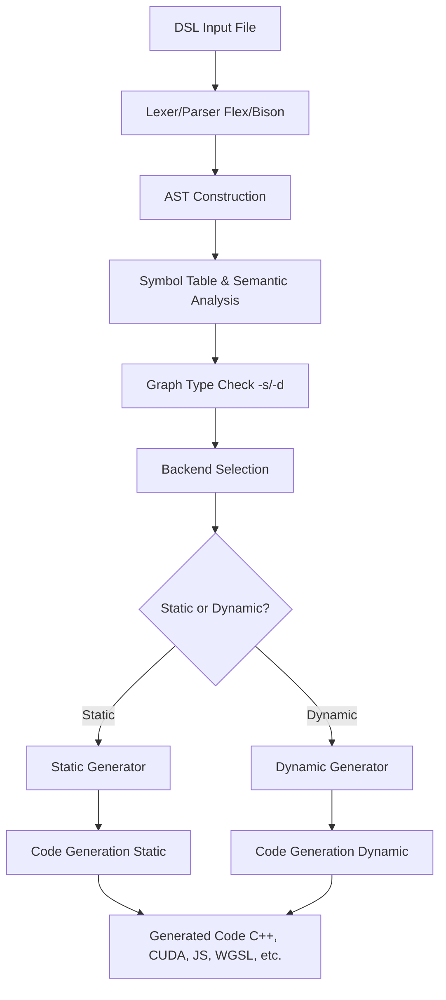

# StarPlat Compiler: Complete Flow & Backend Overview

## Introduction

This document provides a comprehensive overview of the StarPlat compiler, detailing its architecture, compilation flow, and the code generation process for each supported backend. It is intended as a one-stop onboarding reference for new developers joining the project.

---

## Table of Contents

1. [High-Level Architecture](#high-level-architecture)
2. [Compilation Flow](#compilation-flow)
3. [Frontend: Parsing and AST Construction](#frontend-parsing-and-ast-construction)
4. [Intermediate Representation (IR) & Symbol Table](#intermediate-representation-ir--symbol-table)
5. [Backend Code Generation Overview](#backend-code-generation-overview)
    - [OpenMP Backend](#openmp-backend)
    - [CUDA Backend](#cuda-backend)
    - [MPI Backend](#mpi-backend)
    - [HIP Backend](#hip-backend)
    - [SYCL Backend](#sycl-backend)
    - [AMD/OpenCL Backend](#amdopencl-backend)
    - [OpenACC Backend](#openacc-backend)
    - [MultiGPU Backend](#multigpu-backend)
    - [WebGPU Backend](#webgpu-backend)
6. [Adding a New Backend](#adding-a-new-backend)
7. [Key Files and Directories](#key-files-and-directories)
8. [Build & Run Instructions](#build--run-instructions)
9. [Troubleshooting & Debugging](#troubleshooting--debugging)

---

## High-Level Architecture

StarPlat is a domain-specific compiler for graph analytics. It takes a custom DSL (Domain-Specific Language) as input and generates optimized code for various parallel and heterogeneous backends (CPU, GPU, distributed, etc.).

**Major Components:**
- **Frontend:** Parses DSL, builds AST, performs semantic analysis.
- **Intermediate Representation (IR):** AST and symbol table.
- **Backend:** Translates IR to target code (C++, CUDA, OpenMP, MPI, WebGPU, etc.).

---

## Compilation Flow



1. **DSL Input**: User writes algorithm in StarPlat DSL.
2. **Parsing**: Lexer and parser convert DSL to AST.
3. **Semantic Analysis**: Symbol table is built, types and scopes are checked.
4. **Graph Type Check**: Compiler checks `-s` (static) or `-d` (dynamic) flag.
5. **Backend Selection**: User specifies backend (e.g., `-b omp`, `-b cuda`, `-b webgpu`).
6. **Generator Selection**: 
   - Static graphs: Use standard generator (e.g., `spomp::dsl_cpp_generator`)
   - Dynamic graphs: Use dynamic generator (e.g., `spdynomp::dsl_dyn_cpp_generator`)
7. **Code Generation**: Selected generator traverses AST and emits target code.
8. **Output**: Generated code is placed in the appropriate directory.

**Key Decision Points:**
- **Graph Type**: `-s` flag triggers static graph processing, `-d` flag triggers dynamic graph processing
- **Backend Support**: Only OpenMP, MPI, and CUDA support dynamic graphs
- **Generator Class**: Dynamic backends use separate generator classes with `dyn_` prefix

---

## Frontend: Parsing and AST Construction

- **Lexer/Parser**: Implemented using Flex (lexer) and Bison/Yacc (parser).
- **AST (Abstract Syntax Tree)**: Hierarchical tree representing the program structure.
- **Semantic Analysis**: Symbol table is built, variable/function/type checks are performed.
- **Key Files**:
    - `parser/lexer.l`, `parser/lrparser.y`: Lexical and grammar rules.
    - `ast/ASTNode.hpp`, `ast/ASTNodeTypes.hpp`: AST node definitions.
    - `symbolutil/SymbolTableBuilder.cpp`: Symbol table construction and semantic checks.

---

## Intermediate Representation (IR) & Symbol Table

- **AST**: Used as the main IR for code generation.
- **Symbol Table**: Maps identifiers to types, scopes, and other metadata.
- **Parallel Construct Stack**: Tracks parallel regions (e.g., forall, BFS) for backend analysis.

---

## Backend Code Generation Overview

After semantic analysis, the backend is selected based on the user’s command-line option. Each backend has its own code generator class, which traverses the AST and emits code in the target language.

### OpenMP Backend
- **Target**: Multicore CPUs (C++ with OpenMP pragmas)
- **Static Generator**: `spomp::dsl_cpp_generator`
- **Dynamic Generator**: `spdynomp::dsl_dyn_cpp_generator`
- **Flow**:
    1. Traverse AST, emit C++ code.
    2. Insert `#pragma omp` for parallel constructs (e.g., `forall`).
    3. For dynamic graphs: Use dynamic containers and update mechanisms.
    4. Output: `graphcode/generated_omp/`

### CUDA Backend
- **Target**: NVIDIA GPUs (C++ with CUDA extensions)
- **Static Generator**: `spcuda::dsl_cpp_generator`
- **Dynamic Generator**: `spcuda::dsl_dyn_cpp_generator`
- **Flow**:
    1. Traverse AST, emit CUDA C++ code.
    2. Generate device kernels for parallel regions.
    3. Manage device/host memory and kernel launches.
    4. For dynamic graphs: Handle dynamic memory allocation on GPU.
    5. Output: `graphcode/generated_cuda/`

### MPI Backend
- **Target**: Distributed memory systems (C++ with MPI)
- **Static Generator**: `spmpi::dsl_cpp_generator`
- **Dynamic Generator**: `spdynmpi::dsl_dyn_cpp_generator`
- **Flow**:
    1. Traverse AST, emit C++ code with MPI calls.
    2. Insert communication primitives for distributed constructs.
    3. For dynamic graphs: Handle distributed graph updates and synchronization.
    4. Output: `graphcode/generated_mpi/`

### HIP Backend
- **Target**: AMD GPUs (C++ with HIP)
- **Static Generator**: `sphip::DslCppGenerator`
- **Dynamic Support**: NO (Static graphs only)
- **Flow**:
    1. Traverse AST, emit HIP C++ code.
    2. Generate device kernels and manage memory.
    3. Output: `graphcode/generated_hip/`

### SYCL Backend
- **Target**: Heterogeneous (Intel/AMD/NVIDIA) via SYCL
- **Static Generator**: `spsycl::dsl_cpp_generator`
- **Dynamic Support**: NO (Static graphs only)
- **Flow**:
    1. Traverse AST, emit SYCL C++ code.
    2. Generate device kernels and manage buffers.
    3. Output: `graphcode/generated_sycl/`

### AMD/OpenCL Backend
- **Target**: AMD GPUs (OpenCL)
- **Static Generator**: `spamd::dsl_cpp_generator`
- **Dynamic Support**: NO (Static graphs only)
- **Flow**:
    1. Traverse AST, emit OpenCL C++ code.
    2. Generate kernels and manage OpenCL buffers.
    3. Output: `graphcode/generated_amd/`

### OpenACC Backend
- **Target**: Accelerators (OpenACC)
- **Static Generator**: `spacc::dsl_cpp_generator`
- **Dynamic Support**: NO (Static graphs only)
- **Flow**:
    1. Traverse AST, emit C++ code with OpenACC pragmas.
    2. Output: `graphcode/generated_openacc/`

### MultiGPU Backend
- **Target**: Multi-GPU systems
- **Static Generator**: `spmultigpu::dsl_cpp_generator`
- **Dynamic Support**: NO (Static graphs only)
- **Flow**:
    1. Traverse AST, emit C++ code for multi-GPU execution.
    2. Insert data partitioning and device management logic.
    3. Output: `graphcode/generated_multigpu/`

### WebGPU Backend
- **Target**: Any machine with WebGPU support (JavaScript + WGSL)
- **Static Generator**: `spwebgpu::dsl_webgpu_generator`
- **Dynamic Support**: NO (Static graphs only)
- **Flow**:
    1. Traverse AST, emit JavaScript host code for Deno/WebGPU.
    2. For parallel constructs (e.g., `forall`), generate WGSL kernel files.
    3. Output: `graphcode/generated_webgpu/` (JS and WGSL files)

---

## Key Points for adding a New Backend support to StarPlat

1. **Create Backend Directory**: `src/backends/backend_<name>/`
2. **Implement Generator Class**: Follow the pattern of existing backends.
3. **Integrate with Parser**: Add header in `includeHeader.hpp`, add backend logic in `lrparser.y`.
4. **Update Makefile**: Add compilation and linking rules.
5. **Test**: Use sample DSL files and verify generated code.

---

## Key Files and Directories

- `src/parser/`: Lexer, parser, and backend selection logic.
- `src/ast/`: AST node definitions and helpers.
- `src/symbolutil/`: Symbol table and semantic analysis.
- `src/backends/`: All backend code generators.
- `graphcode/generated_<backend>/`: Output directories for generated code.

---

## Graph Types: Static vs Dynamic

StarPlat supports two types of graph processing:

### Static Graphs (`-s` flag)
- **Definition**: Graphs with fixed structure that doesn't change during execution
- **Use Case**: Traditional graph algorithms where the graph structure remains constant
- **Example**: Computing shortest paths on a road network
- **Generated Code**: Uses static graph data structures and algorithms

### Dynamic Graphs (`-d` flag)
- **Definition**: Graphs that can change structure during execution (add/remove nodes/edges)
- **Use Case**: Streaming graph algorithms, graph evolution, real-time graph updates
- **Example**: Social network analysis with real-time friend connections
- **Generated Code**: Uses dynamic graph data structures with update mechanisms

### Backend Support for Dynamic Graphs

Not all backends support dynamic graphs. Currently supported:

| Backend | Static Support | Dynamic Support | Dynamic Generator Class |
|---------|----------------|-----------------|------------------------|
| OpenMP  | YES `spomp::dsl_cpp_generator` | YES `spdynomp::dsl_dyn_cpp_generator` | `dsl_dyn_cpp_generator.cpp` |
| MPI     | YES `spmpi::dsl_cpp_generator` | YES `spdynmpi::dsl_dyn_cpp_generator` | `dsl_dyn_cpp_generator.cpp` |
| CUDA    | YES `spcuda::dsl_cpp_generator` | YES `spcuda::dsl_dyn_cpp_generator` | `dsl_dyn_cpp_generator.cpp` |
| HIP     | YES `sphip::DslCppGenerator` | NO | N/A |
| SYCL    | YES `spsycl::dsl_cpp_generator` | NO | N/A |
| AMD     | YES `spamd::dsl_cpp_generator` | NO | N/A |
| OpenACC | YES `spacc::dsl_cpp_generator` | NO | N/A |
| MultiGPU | YES `spmultigpu::dsl_cpp_generator` | NO | N/A |
| WebGPU  | YES `spwebgpu::dsl_webgpu_generator` | NO | N/A |

### Dynamic Graph Implementation Details

**Key Differences in Dynamic Backends:**
1. **Data Structures**: Use dynamic containers (vectors, maps) instead of static arrays
2. **Update Mechanisms**: Include methods for adding/removing nodes and edges
3. **Memory Management**: Handle dynamic memory allocation and deallocation
4. **Synchronization**: Additional synchronization for concurrent updates

**Example Dynamic Graph DSL (from `dynamicBatchSSSP`):**
```
Dynamic DynSSSP(Graph g, propNode<int> dist, propNode<int> parent, propEdge<int> weight, updates<g> updateBatch, int batchSize, int src) {
  staticSSSP(g, dist, parent, weight, src);
  Batch(updateBatch:batchSize) {
    propNode<bool> modified;
    propNode<bool> modified_add;
    g.attachNodeProperty(modified = false, modified_add = false);
    
    OnDelete(u in updateBatch.currentBatch()): { 
      int src = u.source;
      int dest = u.destination;
      if(dest.parent == src) {
        dest.dist = INT_MAX/2;
        dest.modified = True;
        dest.parent = -1;
      }
    }
    g.updateCSRDel(updateBatch); 
    Decremental(g, dist, parent, weight, modified);   
    
    OnAdd(u in updateBatch.currentBatch()):{
      int src = u.source;
      int dest = u.destination;
      if(dest.dist > src.dist + 1) {
        dest.modified_add = True;
        src.modified_add = True;
      }
    }          
    g.updateCSRAdd(updateBatch);      
    Incremental(g, dist, parent, weight, modified_add);
  }
}
```

This example shows:
- **Dynamic keyword**: Indicates this is a dynamic graph algorithm
- **Batch processing**: `Batch(updateBatch:batchSize)` for processing graph updates in batches
- **Update handlers**: `OnDelete()` and `OnAdd()` for edge deletions/additions
- **Graph modifications**: `g.updateCSRDel()` and `g.updateCSRAdd()` for graph structure changes
- **Incremental/Decremental algorithms**: Separate handling for additions vs deletions

## Build & Run Instructions

1. **Build**:
    ```sh
    cd starplat/src
    make
    ```

2. **Run for Static Graphs**:
    ```sh
    ./StarPlat -s -f <input_dsl_file> -b <backend>
    ```

3. **Run for Dynamic Graphs** (only for supported backends):
    ```sh
    ./StarPlat -d -f <input_dsl_file> -b <backend>
    ```

**Command Line Options:**
- `-s`: Static graph processing
- `-d`: Dynamic graph processing  
- `-f`: Input DSL file path
- `-b`: Backend target (`omp`, `cuda`, `mpi`, `hip`, `sycl`, `amd`, `acc`, `multigpu`, `webgpu`)
- `-o`: Enable optimizations (for supported backends)
- `-m`: Multi-function mode (for supported backends)

**Examples:**
```sh
# Static graph with OpenMP backend
./StarPlat -s -f ../graphcode/staticDSLCodes/triangle_counting_dsl -b omp

# Dynamic graph with CUDA backend  
./StarPlat -d -f ../graphcode/dynamicDSLCodes/dynamic_sssp_dsl -b cuda

# Static graph with WebGPU backend
./StarPlat -s -f ../graphcode/staticDSLCodes/triangle_counting_dsl -b webgpu
```

---

## Troubleshooting & Debugging

- **Segmentation Faults**: Check for null pointers and parallel construct stack management.
- **Build Errors**: Ensure all new files are included in the Makefile and headers.
- **Code Generation Issues**: Add debug prints in backend generator classes.
- **Symbol Table Issues**: Check `SymbolTableBuilder.cpp` for correct parallel region handling.

---

## Conclusion

This document should serve as a go-to reference for understanding and extending the StarPlat compiler. For backend-specific details, refer to the backend’s generator source files for each backend. WebGPU backend has it's implementation document in ```starplat/src/backends/backend_webgpu/README.md```
